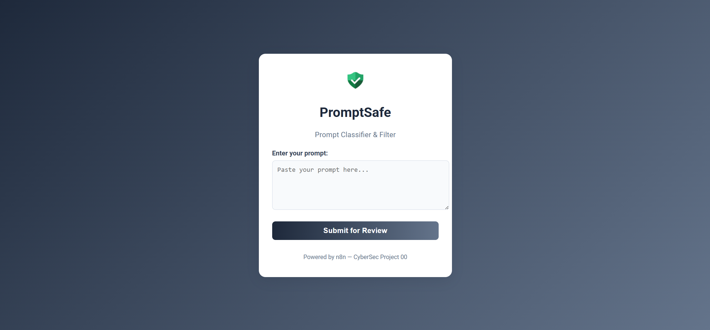

# 🛡️ AI-Security Prompt Filter with n8n

A no-code/low-code prompt security pipeline built using **n8n**, designed to classify and log AI prompts using:
- ✅ Regex-based threat pattern matching
- 🤖 LLM-assisted classification via **Gemini API**
- 📝 Google Sheets integration for real-time logging, review, and updating

---

## 📌 Project Highlights

| Feature                           | Description |
|----------------------------------|-------------|
| 🔍 Regex Filtering                | Pattern-matches user prompts against known threats using dynamic regex rules from Google Sheets |
| 🤖 Gemini Integration             | Prompts not caught by regex are sent to Gemini for LLM-based classification |
| 📊 Prompt Logging                 | All prompts and their classifications (Regex or Gemini) are logged to Google Sheets |
| ⚠️ Review Mechanism              | Unknown or LLM-flagged threats are sent to a **Pending Review** list for human verification |
| 🔁 Threat List Expansion (Optional) | Threat patterns can be updated manually or semi-automatically based on LLM feedback |

---

## 📂 Project Structure

```
AI-Security-Prompt-Filter-n8n/
├── README.md
├── assets/
│   └── workflow_diagram.png
│   └── PromptSafe.png
├── workflows/
│   └── prompt_filter_workflow.json
├── client/
│   └── PromptSafe.html
├── sheets/
│   └── Sample_Google_sheets_structure.xlsx
└── LICENSE
```
## Frontend Prompt Submission

The `client/PromptSafe.html` file is a simple HTML form to submit prompts to the n8n Webhook. It can be opened in a browser to test prompt classification locally.


---

## 🧪 Sample Sheets

The Excel file `Sample_Google_sheets_structure.xlsx` contains:

1. **ThreatPatterns**  
   - List of dynamic regex patterns to detect malicious prompts.
2. **PromptLogs**  
   - Logs all prompts with classification (`Safe`, `Malicious`) and source (`Regex`, `Gemini`)
3. **PendingReview**  
   - Prompts flagged by Gemini but not caught by regex, for manual review and possible threat list expansion.

---

## 🚀 How It Works (Workflow Overview)

1. 🌐 User submits a prompt via Webhook
2. 📄 Google Sheet `ThreatPatterns` is fetched
3. 🧠 Code Node checks for regex matches
4. ⚖️ If matched → labeled `Malicious (Regex)`  
   Else → sent to Gemini API for classification
5. ✍️ Results are logged in Google Sheets:
   - ✅ `PromptLogs` for all inputs
   - ⚠️ `PendingReview` for LLM-flagged unknowns

---

## ⚙️ Setup

1. Clone this repo
2. Import the `.json` file into your n8n instance
3. Configure your:
   - Google Sheets credentials
   - Gemini API key
4. Start the workflow and test via form input

---

## 📌 Use Case

This project was created to demonstrate AI security handling of adversarial or sensitive LLM inputs — useful for threat prompt classification, jailbreak detection, and real-world AI governance tooling.

---

## 🔧 Tech Stack

- [x] **n8n** (self-hosted with persistent memory)
- [x] **Google Sheets** (for threat data + logging)
- [x] **Gemini API** (via HTTP Request Node)

---

## 🧾 License

This project is licensed under the [MIT License](https://opensource.org/licenses/MIT) — free to use, modify, and distribute with attribution.

---

## 📫 Contact

> For suggestions, collaboration, or hiring queries, feel free to reach out via GitHub or LinkedIn!
